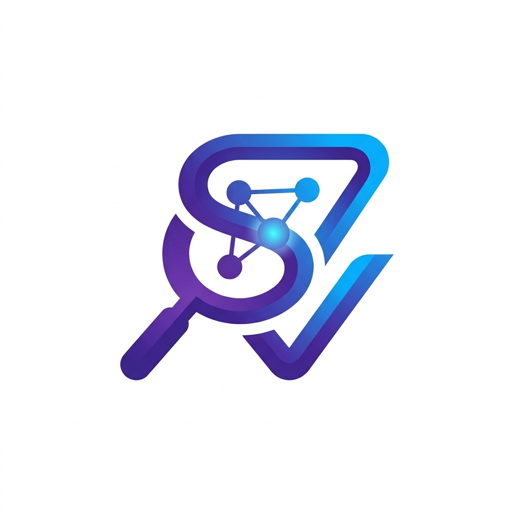

<div align="center">
  
  <h1>Group 17 — AI Candidate Screening & Recommendation System</h1>
  <p>A precision-engineered Hybrid AI matching engine with dual production interfaces for enterprise recruitment.</p>
</div>

[](https://www.sbert.net/)
[]()
[]()
[]()
[]()
[]()

---

## 🎯 Project Overview
This repository contains the production deliverables of the **AI-Based Job Candidate Screening and Recommendation System** developed at **General Sir John Kotelawala Defence University (KDU)**. The system evaluates unstructured resumes (PDF, DOCX, TXT) against target job descriptions using a **Hybrid Semantic & Lexical AI Ensemble** combined with an empirical mathematical calibration layer.

Unlike generic recruitment models that suffer from a **~22% background cosine overlap** (giving non-technical candidates arbitrary 25% match scores for software engineering positions), our engine isolates authentic technical talent with **0.00% non-tech false positives** and **100% Top-1 Precision**.

---

## 🖥️ Dual UI Releases Included

To support diverse operational preferences, the repository provides **two distinct production interfaces**:

| Release | Path | Default Port | Design Language & Focus |
| :--- | :--- | :---: | :--- |
| **v4.1 Classic** | `releases/v4.1/` | **5000** | **Corporate Full-View Dashboard:** Clean light/dark hybrid, multi-panel recruiter telemetry, deep visual analytics charts, and human-in-the-loop feedback mechanisms. |
| **v5.0 Compact** | `releases/v5.0_compact/` | **5001** | **High-Density Minimalist Dark:** Engineered via `/compact-ui-designer`. Slate & emerald palette, Geist typography, isolated 1-screen hero viewport, zero AI glow, unified rounded-xl radius, and 15 automated unit tests. |

Both versions share the exact same underlying AI matching engine, model weights, and calibration pipeline.

---

## 🏗️ System Architecture

The AI engine executes across 5 operational layers:

```
[Candidate Resumes] + [Job Description]
           │
           ▼
┌────────────────────────────────────────┐
│ 1. Ingestion & Preprocessing Layer     │
│    - PDF/DOCX/TXT text extraction      │
│    - Multi-Span Date Tenure Parser     │
│    - Sliding-Window Document Chunker   │
└──────────────────┬─────────────────────┘
                   │
                   ▼
┌────────────────────────────────────────┐
│ 2. Tri-Tier AI Matching Ensemble       │
│    ├─ Fine-Tuned Domain SBERT (65%)    │
│    ├─ Domain-Adapted TF-IDF (20%)      │
│    └─ Skill Cluster Taxonomy (15%)     │
└──────────────────┬─────────────────────┘
                   │
                   ▼
┌────────────────────────────────────────┐
│ 3. Mathematical Calibration Layer      │
│    - Baseline Floor Rescaling (22.3%)  │
│    - Dynamic Experience Bonus (≤15%)   │
│    - Technical Gatekeeper (0% hard-cut)│
└──────────────────┬─────────────────────┘
                   │
                   ▼
┌────────────────────────────────────────┐
│ 4. Explainable Decision Output         │
│    - Highly Suitable (≥ 60%)           │
│    - Suitable (38% - 59.9%)            │
│    - Low Match (< 38%)                 │
│    - Skills Found & Missing Highlights │
└────────────────────────────────────────┘
```

1. **Input Ingestion Layer:** Ingests structured job descriptions and candidate resumes in PDF, DOCX, and TXT formats.
2. **Preprocessing & Feature Extraction:**
   * **Multi-Span Date Range Tenure Parser:** Computes cumulative career experience across multi-job work history.
   * **Sliding-Window Document Chunker:** Overcomes 256-token transformer truncation limits by scoring 140-word overlapping windows.
3. **Hybrid AI Matching Ensemble:**
   * **Fine-Tuned Domain SBERT (65% Weight):** 6-layer Transformer encoder (`all-MiniLM-L6-v2`) fine-tuned with Multiple Negatives Ranking Loss (MNRL).
   * **Domain-Adapted TF-IDF (20% Weight):** Sublinear frequency vectorizer pre-fitted on 2,076 documents with 48,393 technical n-grams.
   * **Bounded Skill Taxonomy (15% Weight):** 143+ industry competencies categorized into engineering clusters awarding bounded partial credit.
4. **Mathematical Calibration & Heuristics:**
   * **Baseline Floor Rescaling:** Neutralizes universal English background overlap.
   * **Dynamic Experience Bonus:** Tenured candidates receive $+15.0\% \times \sqrt{\text{Score}_{\text{calibrated}} / 100}$.
   * **Technical Gatekeeper Filter:** Enforces a hard $0.0\%$ score if no technical skills are detected.
5. **Explainable AI (XAI) Dashboard:** Highlights "Skills Found" vs "Missing Skills" and provides CSV/JSON export.

---

## 🛠️ How to Run Locally

### 1. Clone the Repository
```bash
git clone https://github.com/RK-Soori/Group-17-AI-Screener.git
cd Group-17-AI-Screener
```

### 2. Install Dependencies
Ensure Python 3.10+ is installed:
```bash
pip install -r requirements.txt
```

### 3. Launch the Applications

#### Option A: Run v4.1 Classic (Port 5000)
```bash
cd releases/v4.1
python app.py
```
Open browser at: **`http://127.0.0.1:5000`**

#### Option B: Run v5.0 Compact (Port 5001)
```bash
cd releases/v5.0_compact
python app.py --port 5001
```
*Or on Windows: double-click `run_compact.bat`.*  
Open browser at: **`http://127.0.0.1:5001`**

#### Option C: Run Both Simultaneously
Open two separate terminal windows and run both commands above. You can compare the classic and compact interfaces side-by-side!

---

## 🧪 Automated Testing

To run the unit test suite for the v5.0 compact release:
```bash
cd releases/v5.0_compact
python test_v5_compact.py
```
*Runs 15 test suites covering routes, chunking, calibration math, XAI extraction, and gatekeeper rules.*

---

## 📚 Academic Documentation

Full academic reports and audit records are located in the [`docs/`](docs/) directory:
* [`docs/FINAL_AI_PROJECT_REPORT.md`](docs/FINAL_AI_PROJECT_REPORT.md): Complete IEEE/KDU canonical 11-section Final Project Report.
* [`docs/FINAL_AI_PROJECT_REPORT.docx`](docs/FINAL_AI_PROJECT_REPORT.docx): Formatted Word submission document with embedded figures.
* [`docs/FINAL_REPORT_VERIFICATION_AND_AUDIT.md`](docs/FINAL_REPORT_VERIFICATION_AND_AUDIT.md): Mathematical and empirical audit review.

---

## 👥 Group 17 Team Members
**General Sir John Kotelawala Defence University • Faculty of Computing**

| Student Name | Registration No | Degree Program | Main Responsibilities |
| :--- | :--- | :---: | :--- |
| **Kavinda Sooriyarachchi** | D/COE/25/0016 | COE | SBERT GPU Fine-Tuning, Chunking Engine, Baseline Calibration & Backend Integration |
| **R.T.I.K. Prabodhani** | D/DBA/25/0010 | DBA | Requirement Engineering, Technical Gatekeeper & Transferability Rules |
| **K.V.P.M. Sewmini** | D/BIS/24/0012 | IS | Multi-Span Date Range Tenure Parser, Real-World Dataset Acquisition & Testing |
| **O.K.D.A. Dilmira** | D/BIT/24/0055 | IT | Domain TF-IDF Vectorization, Web Application UI & Benchmark Visualizations |

---

## 📝 License
This project is developed as part of academic coursework for the *Essentials of Artificial Intelligence* module at KDU Faculty of Computing.
