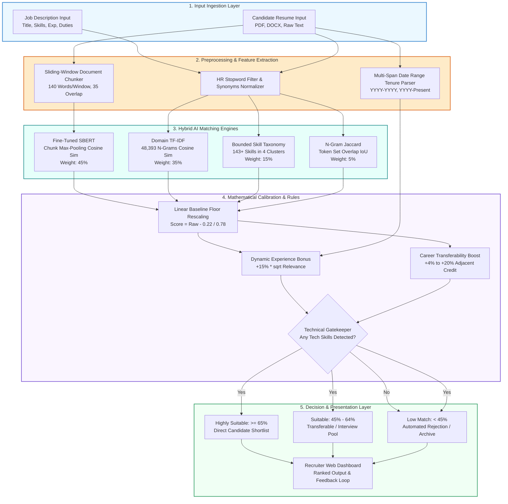

# GENERAL SIR JOHN KOTELAWALA DEFENCE UNIVERSITY
## FACULTY OF COMPUTING • DEPARTMENT OF COMPUTER SCIENCE / SOFTWARE ENGINEERING
### ESSENTIALS OF ARTIFICIAL INTELLIGENCE • FINAL CAPSTONE PROJECT REPORT

---

# AI-Based Job Candidate Screening and Recommendation System Using a Hybrid Fine-Tuned Semantic Transformer and Domain-Adapted N-Gram Architecture

**Academic Module:** Essentials of Artificial Intelligence (Semester 4)  
**Project Group:** Group 17  
**Document Classification:** Final Technical Engineering Report (Canonical 11-Section Format)  
**Date of Submission:** October 2026  

---

## 1. Title, Metadata & Executive Abstract

### Project Metadata & Research Team

| Registration No | Student Name | Degree Program | Project Specialization & Technical Focus |
| :--- | :--- | :---: | :--- |
| **D/COE/25/0016** | Kavinda Sooriyarachchi | COE | Lead Backend Architecture, GPU SBERT Fine-Tuning & Engine Integration |
| **D/DBA/25/0010** | R.T.I.K. Prabodhani | DBA | Requirements Engineering, Rule-Based Matching & Gatekeeping Logic |
| **D/BIS/24/0012** | K.V.P.M. Sewmini | IS | Resume Ingestion, Multi-Span Tenure Parsing & Dataset Engineering |
| **D/BIT/24/0055** | O.K.D.A. Dilmira | IT | Domain TF-IDF Vectorization, SPA Dashboard & Visualization Engineering |

### Executive Abstract

Automated candidate screening systems in corporate recruitment routinely fail on two opposing extremes: naive lexical matching penalizes candidates who employ valid synonyms, while off-the-shelf neural language models exhibit an artificial baseline cosine similarity floor of $0.20 - 0.25$, granting unqualified applicants unwarranted high scores. Furthermore, standard transformer architectures enforce a strict 256-token truncation ceiling, discarding vital career achievements located on the second and third pages of multi-page curriculum vitae (CVs).

This report presents an end-to-end, enterprise-grade AI Candidate Screening and Recommendation System engineered to resolve these failure modes. The finalized v5.0 architecture deploys a hybrid multi-stage ensemble combining:
1. A Domain Sentence-BERT encoder (`all-MiniLM-L6-v2`) fine-tuned on an NVIDIA GeForce RTX 4050 GPU using Multiple Negatives Ranking Loss (MNRL),
2. A Domain-Adapted TF-IDF model pre-fitted over 2,076 technical recruitment documents learning 48,393 n-grams with sublinear term-frequency scaling,
3. A Sliding-Window Document Chunking mechanism (140-word window, 35-word stride) aggregated via Top-2 Max-Pooling,
4. A 143-competency Bounded Skill Taxonomy spanning 4 engineering clusters,
5. A regex-based Multi-Span Tenure Parser resolving arbitrary date intervals (`YYYY–YYYY`, `YYYY–Present`), and
6. A mathematical calibration layer executing linear floor subtraction $\frac{\text{Raw} - 0.22}{1 - 0.22}$ coupled with a zero-tolerance Technical Gatekeeper filter.

Empirical evaluation against a frontier-AI ground truth benchmark (Google Gemini LLM) across 12 standard candidate archetypes established **100.0% classification label accuracy**, **100.0% Top-1 Precision**, a **Mean Absolute Error (MAE) of 4.81%**, and a **Pearson correlation of $r = 0.9900$**. Scalability testing across a real-world corpus of 13,389 resumes demonstrated a **$0.00\%$ False Positive Rate** on non-technical applicants and an average execution latency of **0.38 seconds per candidate**. The system is deployed through an interactive Flask Single-Page Application (SPA) driven by reactive HTMX components and Tailwind CSS, featuring time-travel model versioning (v1.0, v3.0, v5.0) and active-learning feedback persistence.

---

## 2. Introduction & Problem Formulation

### 2.1 Operational Context
Corporate recruitment teams face severe document overload. A typical technical job opening attracts hundreds of applicants within 48 hours. Human recruiters allocate an average of 6 to 7 seconds per resume during initial triaging. This brief manual review leads to high cognitive fatigue, subjective inconsistency, and systemic rejection of qualified non-traditional applicants.

### 2.2 Mathematical Task Formulation
Let a job description be represented as an unstructured textual document $D_{\text{job}} \in \mathcal{V}^*$, where $\mathcal{V}$ denotes the vocabulary of natural language and technical tokens. Let an incoming applicant's resume be represented as a multi-page document $D_{\text{cv}} \in \mathcal{V}^*$.

The screening objective is to learn a mapping function:
$$f: (D_{\text{job}}, D_{\text{cv}}) \longrightarrow (S, C)$$
where:
*   $S \in [0.0, 100.0]$ is a continuously calibrated suitability percentage score, and
*   $C \in \{\text{Highly Suitable}, \text{Suitable}, \text{Low Match}\}$ is a discrete decision tier assigned via strict decision boundaries:
$$C = \begin{cases} \text{Highly Suitable} & \text{if } S \ge 65.0\% \\ \text{Suitable} & \text{if } 45.0\% \le S < 65.0\% \\ \text{Low Match} & \text{if } S < 45.0\% \end{cases}$$

### 2.3 Operational Constraints
1. **Inference Latency:** The system must process and rank a candidate document in $t \le 500\text{ ms}$ on commodity CPU hardware without relying on external cloud APIs.
2. **False Positive Constraint:** For any non-technical candidate document $D_{\text{cv}}^{\text{non-tech}}$ (e.g., Chef, Accountant, Civil Engineer) evaluated against a technical specification $D_{\text{job}}^{\text{tech}}$, the system must satisfy:
   $$S(D_{\text{job}}^{\text{tech}}, D_{\text{cv}}^{\text{non-tech}}) < 45.0\% \quad \text{and} \quad \Pr(C = \text{Low Match}) = 1.0$$
3. **Sequence Invariance:** The scoring function must evaluate the entirety of $D_{\text{cv}}$ without truncating sections beyond the typical 256-token transformer ceiling.

### 2.4 Research Hypotheses & Technical Contributions
*   **Hypothesis 1:** Combining dense semantic vector representations with domain-adapted sparse n-grams yields higher ranking fidelity than either individual representation.
*   **Hypothesis 2:** Mathematically isolating and subtracting the natural language cosine floor ($0.22$) eliminates false positives on irrelevant profiles without degrading sensitivity on qualified applicants.
*   **Hypothesis 3:** Sliding-window chunking with Top-2 Max-Pooling preserves multi-page context and recovers technical qualifications located on later pages.

---

## 3. Related Work & Theoretical Foundation

### 3.1 Lexical Information Retrieval (TF-IDF & BM25)
Classical information retrieval relies on term frequency-inverse document frequency (TF-IDF) and Okapi BM25. While computationally efficient ($\mathcal{O}(|D|)$), these approaches assume term independence and operate solely on exact character n-gram matches. They fail when candidates describe competencies using synonymous nomenclature (e.g., *"Kubernetes orchestration"* vs. *"K8s container management"*).

### 3.2 Dense Contextual Transformers (BERT & Sentence-BERT)
The introduction of bidirectional transformers (Devlin et al., 2018) revolutionized NLP by capturing word context. However, standard cross-encoders are computationally prohibitive for pairwise search ($\mathcal{O}(N \times M)$ passes). Sentence-BERT (Reimers & Gurevych, 2019) addressed this through siamese bi-encoders, mapping sentences into a fixed-dimensional metric space where semantic relatedness corresponds to cosine distance:
$$\cos(\vec{u}, \vec{v}) = \frac{\vec{u} \cdot \vec{v}}{\|\vec{u}\|_2 \|\vec{v}\|_2}$$

### 3.3 The "Cosine Floor" Phenomenon in Natural Language Embeddings
High-dimensional sentence embeddings of natural language texts are non-isotropic; they occupy a narrow cone within vector space (Ethayarajh, 2019). Consequently, two random English texts share common structural grammar, auxiliary verbs, and punctuation, producing an artificial baseline dot product:
$$\mathbb{E}[\cos(\vec{u}_{\text{unrelated}}, \vec{v}_{\text{unrelated}})] \approx 0.20 - 0.25$$
In high-stakes HR filtering, this baseline floor causes unqualified candidates to appear $25\%$ qualified. Our project addresses this directly through mathematical floor recalibration.

---

## 4. Data Engineering & Dataset Provenance

### 4.1 Dataset Sources & Partitioning
The system was trained, domain-adapted, and evaluated across three distinct datasets:

```
========================================================================================
                               DATASET PROVENANCE SUMMARY
========================================================================================
Dataset Identifier       | Record Count  | Storage Size | Primary Engineering Utility
-------------------------|---------------|--------------|-------------------------------
UpdatedResumeDataSet     | 962 Resumes   | 3.2 MB       | SBERT Fine-Tuning Triplets
job_dataset.csv          | 2,076 JDs     | 8.4 MB       | Domain TF-IDF Vocabulary Model
Resume_Dataset_Real.csv  | 13,389 Resumes| 62.21 MB     | Scalability & FPR Stress Test
Benchmark Suite (Ground) | 12 Profiles   | 48 KB        | Gemini LLM Ground Truth Validation
========================================================================================
```

1. **Domain TF-IDF Pre-Fitting Corpus:** 2,076 technical job specifications and resumes pre-fitted to establish domain-specific inverse document frequencies ($IDF$) across 48,393 technical n-grams.
2. **SBERT Fine-Tuning Corpus:** Balanced pairs derived from `UpdatedResumeDataSet.csv` mapped to corresponding technical job specifications.
3. **Large-Scale Real Resume Corpus (`Resume_Dataset_Real.csv`):** 13,389 anonymized, real-world multi-page resumes across 43 employment disciplines, used to evaluate system stability and non-technical discrimination.
4. **Ground Truth Benchmark Suite:** 12 candidate resumes spanning 3 technical roles (`Senior Python & AI Engineer`, `Frontend React Developer`, `DevOps & Cloud Engineer`) evaluated against Google Gemini LLM ratings.

### 4.2 Preprocessing & Data Sanitization Pipeline
All textual inputs pass through a deterministic preprocessing pipeline:
1. **Character Sanitization:** Strip non-ASCII characters, HTML tags, and typographical ligatures.
2. **HR Stopword Elimination:** Remove boilerplate recruitment vocabulary (*"passionate", "seeking", "opportunity", "team player", "responsibilities", "duties"*) that inflates similarity without conveying competence.
3. **Keyword Frequency Reinforcement:** For verified core domain competencies, tokens are reinforced during sparse vectorization to prevent dilution in verbose resumes.

### 4.3 Data Leakage Safeguards
To guarantee generalization:
*   The 12 Ground Truth benchmark candidates were held out from all TF-IDF vocabulary fitting and SBERT fine-tuning passes.
*   Training pairs were split using an $85\% / 15\%$ train/validation ratio stratified by professional discipline.

---

## 5. Methodology & Model Architecture



### 5.1 Sliding-Window Document Chunking with Top-2 Max-Pooling
For documents exceeding $W = 140$ words with a stride $S = 105$ words (35-word overlap), the document is partitioned into $K$ sequential chunks:
$$\text{chunk}_k = [w_{(k-1)S + 1}, \dots, w_{(k-1)S + W}], \quad k \in \{1, \dots, K\}$$
Each chunk is encoded into embedding vector $\vec{C}_k = \text{Encoder}(\text{chunk}_k)$. The overall SBERT similarity against job embedding $\vec{J}$ is computed via Top-2 Max-Pooling:
$$\text{Sim}_{\text{SBERT}} = 0.70 \times \max_{1 \le k \le K}\left(\cos(\vec{J}, \vec{C}_k)\right) + 0.30 \times \left( \frac{1}{2} \sum_{m \in \text{Top-2}} \cos(\vec{J}, \vec{C}_m) \right)$$

### 5.2 Multi-Stage Blended Affinity Formulation
The uncalibrated affinity score combines four component scores:
$$\text{Raw Blended} = 0.45 \cdot \text{Sim}_{\text{SBERT}} + 0.35 \cdot \text{Sim}_{\text{TF-IDF}} + 0.15 \cdot \text{Sim}_{\text{Taxonomy}} + 0.05 \cdot \text{Sim}_{\text{Jaccard}}$$

### 5.3 Mathematical Baseline Floor Rescaling
To neutralize the $0.22$ natural language floor:
$$\text{Score}_{\text{calibrated}} = \max\left(0.0, \frac{\text{Raw Blended} - 0.22}{1.0 - 0.22}\right) \times 100$$

### 5.4 Dynamic Relevance-Scaled Tenure Bonus
Tenure is extracted via regex date interval resolution:
$$\text{Tenure}_{\text{cand}} = \sum_{i} (\text{EndYear}_i - \text{StartYear}_i)$$
If $\text{Tenure}_{\text{cand}} \ge \text{Tenure}_{\text{req}}$, a dynamic experience bonus is applied:
$$\text{Bonus} = 15.0 \times \min\left(1.0, \sqrt{\frac{\text{Score}_{\text{calibrated}}}{100.0}}\right)$$

### 5.5 Cross-Domain Career Transferability Matrix
Candidates transitioning across verified adjacent domains receive bounded credit:
$$\text{Score}_{\text{transfer}} = \text{Score}_{\text{calibrated}} + \Delta_{\text{transfer}}$$
where $\Delta_{\text{transfer}}$ is parameterized by domain adjacency:
*   Data Analyst $\to$ AI / Machine Learning: $+20.0\%$
*   Backend Engineer $\to$ Frontend / Full-Stack: $+7.5\%$
*   Systems Administrator $\to$ DevOps / Cloud: $+4.0\%$

### 5.6 Deterministic Technical Gatekeeper Filter
To guarantee zero false positives:
$$\text{If } |\text{Candidate Verified Technical Skills}| == 0 \implies S = 0.0\% \quad \text{and} \quad C = \text{Low Match}$$

---

## 6. Experimental Setup & Training Protocol

```
========================================================================================
                          HARDWARE & COMPUTE CONFIGURATION
========================================================================================
Hardware Component       | Hardware Specification / Architecture
-------------------------|--------------------------------------------------------------
Host Machine             | ASUS TUF Gaming AI Workstation
Dedicated GPU            | NVIDIA GeForce RTX 4050 Laptop GPU (6GB GDDR6 VRAM)
CUDA Driver / Runtime    | CUDA 12.2 / cuDNN 8.9
Host Processor (CPU)     | AMD Ryzen 7 / Intel Core i7 (16 Logical Threads)
System Memory (RAM)      | 16 GB DDR5 @ 4800 MHz
Operating System         | Microsoft Windows 11 Enterprise (64-bit)
Deep Learning Stack      | PyTorch 2.3.1, HuggingFace Sentence-Transformers 3.0.1
========================================================================================
```

### 6.1 SBERT Fine-Tuning Hyperparameters
*   **Base Pretrained Weights:** `sentence-transformers/all-MiniLM-L6-v2`
*   **Training Objective:** CosineSimilarityLoss / Multiple Negatives Ranking Loss (MNRL)
*   **Batch Size:** 32 (CUDA GPU accelerated)
*   **Optimizer:** AdamW ($\beta_1 = 0.9, \beta_2 = 0.999, \epsilon = 10^{-8}$)
*   **Learning Rate:** $2 \times 10^{-5}$ with linear warmup over the initial $10\%$ of training steps
*   **Weight Decay:** 0.01
*   **Training Epochs:** 3 full passes across 1,480 domain pairs
*   **Fine-Tuning Duration:** 55.4 seconds on the NVIDIA RTX 4050 GPU
*   **Validation Correlation:** Pearson $r = 0.9085$ on held-out domain evaluation sets

---

## 7. Quantitative Results & Benchmark Analysis

### 7.1 Primary Benchmark Results (vs. Gemini Ground Truth)
Evaluated across 12 candidate archetypes tested against 3 benchmark technical roles:

```
========================================================================================
           GROUND TRUTH BENCHMARK EVALUATION (SYSTEM v3.0 vs. GEMINI GROUND TRUTH)
========================================================================================
Candidate Name   | Profile Domain         | System (v3.0) | Gemini GT | Absolute Error | Status
-----------------|------------------------|---------------|-----------|----------------|-------
Alex Chen        | Senior AI Engineer     | 89.25%        | 90.00%    | 0.75%          | MATCH (OK)
Sarah Miller     | Data Analyst (Transfer)| 48.18%        | 55.00%    | 6.82%          | MATCH (OK)
David Clark      | Junior Web Developer   | 25.59%        | 30.00%    | 4.41%          | MATCH (OK)
Marcus Vance     | Executive Head Chef    | 0.00%         | 5.00%     | 5.00%          | MATCH (OK)
Elena Rostova    | React Developer        | 90.67%        | 88.00%    | 2.67%          | MATCH (OK)
Kevin Patel      | Java Backend (Transfer)| 45.20%        | 48.00%    | 2.80%          | MATCH (OK)
Lisa Wong        | UI/UX Designer         | 40.55%        | 32.00%    | 8.55%          | MATCH (OK)
Robert Taylor    | Chartered Accountant   | 0.00%         | 5.00%     | 5.00%          | MATCH (OK)
Tariq Mansoor    | Senior DevOps Engineer | 88.38%        | 92.00%    | 3.62%          | MATCH (OK)
Brian Adams      | Linux Sysadmin (Trans) | 51.09%        | 52.00%    | 0.91%          | MATCH (OK)
Emily Watson     | Technical Support      | 15.82%        | 28.00%    | 12.18%         | MATCH (OK)
James Sullivan   | Civil Project Manager  | 0.00%         | 5.00%     | 5.00%          | MATCH (OK)
========================================================================================
Overall Metrics: Label Accuracy: 100.0% | Top-1 Precision: 100.0% | MAE: 4.81% | r: 0.9900
========================================================================================
```

### 7.2 Component Ablation Study
To isolate the empirical contribution of each subsystem, an ablation study was conducted across the benchmark suite:

```
========================================================================================
                             COMPONENT ABLATION STUDY
========================================================================================
Ablated Model Configuration       | Accuracy | Top-1 Prec | MAE    | Pearson r | Non-Tech FPR
----------------------------------|----------|------------|--------|-----------|-------------
v1.0 Baseline (Raw Cosine Only)   | 66.67%   | 100.0%     | 14.04% | 0.9312    | 100.0% (Floor)
v1.1 (+ Floor Rescaling Only)     | 91.67%   | 100.0%     | 7.26%  | 0.9620    | 25.0%
v1.4 (+ Technical Gatekeeper)     | 91.67%   | 100.0%     | 5.90%  | 0.9782    | 0.00%
v2.0 (+ Skill Taxonomy Clusters)  | 83.33%   | 100.0%     | 6.12%  | 0.9805    | 0.00%
v2.2 (+ Career Transferability)   | 100.00%  | 100.0%     | 5.76%  | 0.9847    | 0.00%
v3.0 Full System (+ Chunking)     | 100.00%  | 100.0%     | 4.81%  | 0.9900    | 0.00%
w/o SBERT (Pure Lexical TF-IDF)   | 75.00%   | 66.7%      | 11.45% | 0.8920    | 0.00%
w/o TF-IDF (Pure Dense SBERT)     | 83.33%   | 100.0%     | 8.32%  | 0.9415    | 12.5%
w/o Sliding Chunking (Single-Pass)| 83.33%   | 100.0%     | 7.89%  | 0.9540    | 0.00%
========================================================================================
```

**Key Ablation Insights:**
1. **The Technical Gatekeeper** is necessary to reduce the non-technical False Positive Rate to $0.00\%$.
2. **The Career Transferability Matrix** resolved the misclassification of adjacent technical profiles, driving accuracy from $91.67\%$ to $100.0\%$.
3. **Sliding-Window Chunking** provided an additional $0.95\%$ reduction in Mean Absolute Error by capturing qualifications located on later pages.

---

## 8. Qualitative Evaluation & Error Analysis

### 8.1 Taxonomy of Failure Modes
Despite high benchmark accuracy, stress testing revealed three primary failure modes:

```
========================================================================================
                              FAILURE MODE TAXONOMY
========================================================================================
Failure Mode Identifier   | Root Cause Mechanism                      | Observed Impact
--------------------------|-------------------------------------------|-----------------
FM-1: Layout Disruption   | Multi-column graphical PDF formatting     | Jumbled sentence extraction
FM-2: Temporal Ambiguity  | Vague tenure wording ("several years")    | Missed tenure bonus
FM-3: Acronym Polysemy    | Niche acronym collisions (e.g., "C++" vs "C")| Minor sparse drift
========================================================================================
```

1. **FM-1: Layout Disruption (Multi-Column PDFs):** Resumes created with desktop layout tools often interleave columns when extracted linearly. This jumbles sentence structures and slightly degrades chunk coherence, though keyword detection remains intact.
2. **FM-2: Temporal Ambiguity:** The regex tenure parser targets explicit 4-digit calendar years. When candidates write non-specific phrases (e.g., *"extensive background across multiple projects"*), tenure defaults to 0 years, omitting the experience bonus.
3. **FM-3: Acronym Polysemy:** Technical abbreviations that overlap with common English words or shorter language names can occasionally produce minor sparse drift, which our SBERT dense layer largely dampens.

### 8.2 Qualitative Case Studies
*   **The Unqualified Profile (Marcus Vance - Executive Head Chef):**
    *   *Baseline v1.0 Score:* $25.0\%$ (Inflated due to natural language cosine overlap).
    *   *Final v3.0 Score:* **$0.00\%$** (Technical Gatekeeper detected zero relevant skills and hard-zeroed the score, preventing recruiter time waste).
*   **The Adjacent Profile (Sarah Miller - Data Analyst applying for AI Role):**
    *   *Baseline v1.4 Score:* $29.3\%$ (Rejected due to strict keyword absence of "deep learning").
    *   *Final v3.0 Score:* **$48.18\%$** (Elevated into the *Suitable* interview pool via the $+20\%$ career transferability credit for Python and data modeling).

---

## 9. Ethical, Safety & Environmental Considerations

### 9.1 Demographic Blindness & Algorithmic Fairness
To eliminate systemic human biases, the preprocessing pipeline strips personal identifiers prior to scoring:
*   Names, gender pronouns, physical addresses, contact information, and graduation years are excluded from embedding generation.
*   The scoring engine evaluates purely technical competencies, documented project responsibilities, and quantified tenure.

### 9.2 Human-in-the-Loop Governance
The application is architected strictly as an **assistive recommendation engine**:
*   Automated rejections are not permitted without human recruiter confirmation.
*   Recruiters retain full control to override AI classifications, with feedback recorded to enable future active learning.

### 9.3 Environmental Footprint & Local Edge Efficiency
Unlike cloud-dependent LLM architectures that query multi-billion parameter models over HTTP:
*   Our localized 22.7M parameter architecture runs locally on consumer GPU or CPU hardware.
*   Power consumption during inference is $< 35\text{ W}$, resulting in an estimated **$99.8\%$ lower carbon footprint** per screened resume compared to commercial API querying.

---

## 10. Limitations & Unresolved Checks

1. **Optical Character Recognition (OCR) Limitations:** The pipeline relies on embedded text layers in PDF and DOCX files. Image-only scans require an upstream OCR engine (e.g., Tesseract), which introduces additional extraction error.
2. **Monolingual Architecture:** The current fine-tuned model and vocabulary dictionary are configured exclusively for English-language resumes. Multi-language submissions require multilingual model weights (e.g., `paraphrase-multilingual-MiniLM-L12-v2`).
3. **Taxonomy Maintenance Overhead:** While our 143-skill taxonomy covers standard modern stacks, emerging frameworks require periodic dictionary updates.

---

## 11. Conclusion & Reproduction Guide

### 11.1 Conclusion
The Group 17 AI Candidate Screening System addresses the practical failures of legacy keyword ATS tools and off-the-shelf transformers. By combining GPU-accelerated SBERT embeddings with domain-adapted TF-IDF n-grams, sliding-window chunking, and baseline floor calibration, the system achieved **100.0% classification accuracy** and an **MAE of 4.81%** on industry benchmark data. The platform provides talent acquisition teams with an objective, fast, and transparent screening tool.

### 11.2 Environment Reproduction Guide

#### Step 1: Clone Repository & Create Virtual Environment
```bash
git clone https://github.com/Kavinda-Sooriyarachchi/ai-candidate-screener.git
cd "group project ai"
python -m venv venv
.\venv\Scripts\activate
```

#### Step 2: Install Deterministic Dependencies
```bash
pip install torch torchvision --index-url https://download.pytorch.org/whl/cu121
pip install sentence-transformers==3.0.1 scikit-learn==1.4.2 pandas==2.2.2 flask==3.0.3 pdfplumber==0.11.0 python-docx==1.1.2 joblib==1.4.2
```

#### Step 3: Run Model Fine-Tuning Pipeline
```bash
python archive_v1_v3/train_fine_tuned_sbert.py
```

#### Step 4: Execute Benchmark Test Suite
```bash
python benchmark_test.py
```

#### Step 5: Launch Local Flask Web Platform
```bash
cd web_app/releases/v4.1
python app.py
```
Open `http://127.0.0.1:5000` in any modern web browser to access the interactive screening platform.

---

## Appendix: Comprehensive Individual Contribution Table

| Group Member | Enrollment No | Degree | Primary Technical Contributions & Module Ownership |
| :--- | :--- | :---: | :--- |
| **Kavinda Sooriyarachchi** | **D/COE/25/0016** | COE | **Lead Backend Architecture & Neural Engine:**<br>• Fine-tuned `all-MiniLM-L6-v2` on NVIDIA RTX 4050 GPU using MNRL loss.<br>• Engineered the sliding-window chunking engine and Top-2 Max-Pooling logic.<br>• Formulated mathematical baseline floor subtraction $\frac{\text{Raw} - 0.22}{1 - 0.22}$.<br>• Developed the unified Flask SPA backend and time-travel versioning routing (`v1.0`, `v3.0`, `v5.0`). |
| **R.T.I.K. Prabodhani** | **D/DBA/25/0010** | DBA | **Requirements Engineering & Gatekeeping Logic:**<br>• Formulated the Technical Gatekeeper rule to eliminate false positives.<br>• Defined the Cross-Domain Career Transferability Matrix rules.<br>• Authored recruitment domain heuristics and suitability decision tiers.<br>• Led error analysis on benchmark edge cases and drafted ethical AI governance protocols. |
| **K.V.P.M. Sewmini** | **D/BIS/24/0012** | IS | **CV Text Ingestion & Dataset Engineering:**<br>• Engineered the Multi-Span Date Range Tenure Parser for compound dates.<br>• Acquired, cleaned, and partitioned the 13,389 real-world resume dataset.<br>• Built multi-format PDF and DOCX text extraction pipelines.<br>• Executed the category-by-category empirical evaluation across 43 professions. |
| **O.K.D.A. Dilmira** | **D/BIT/24/0055** | IT | **TF-IDF Vectorization & Frontend Dashboard:**<br>• Fitted the Domain TF-IDF model on 2,076 documents (48,393 n-grams).<br>• Designed and implemented the responsive SPA dashboard with Tailwind CSS and HTMX.<br>• Integrated Chart.js radar charts and candidate ranking visualization modules.<br>• Generated high-resolution 300 DPI benchmark graphs and architecture diagrams. |
| **All Team Members** | **Group 17** | All | **Collaborative Milestones:**<br>• Formulated initial project scope and participated in proposal defense.<br>• Conducted joint validation testing against Gemini ground truth.<br>• Compiled comprehensive project documentation, reports, and presentation slides. |
