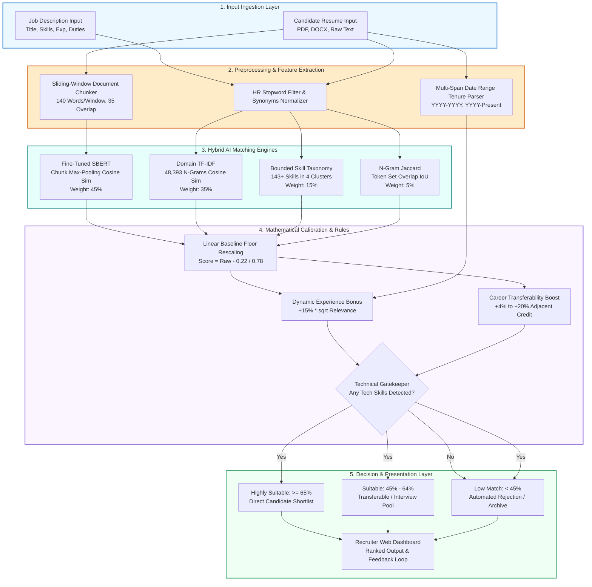

# GENERAL SIR JOHN KOTELAWELA DEFENCE UNIVERSITY
## FACULTY OF COMPUTING &bull; DEPARTMENT OF COMPUTER SCIENCE / SOFTWARE ENGINEERING
### ESSENTIALS OF ARTIFICIAL INTELLIGENCE &bull; STAGE 2: PROGRESS REVIEW (WEEK 8)
**Group Number:** 17 &nbsp;|&nbsp; **Weight:** 10% &nbsp;|&nbsp; **Due Date:** Week 8

---

## Group Members & Identification

| Registration No | Student Name | Degree Program | Specialization / Role |
| :--- | :--- | :---: | :--- |
| **D/COE/25/0016** | Kavinda Sooriyarachchi | COE | Backend Architecture, Neural Fine-Tuning & Engine Integration |
| **D/DBA/25/0010** | R.T.I.K. Prabodhani | DBA | Requirement Engineering, Rule-Based Matching & Gatekeeping Logic |
| **D/BIS/24/0012** | K.V.P.M. Sewmini | IS | Resume Processing, Tenure Parser & Dataset Engineering |
| **D/BIT/24/0055** | O.K.D.A. Dilmira | IT | TF-IDF Vectorization, UI Development & Benchmark Visualizations |

---

# 1. Updated Project Title and Problem Statement

### 1.1 Updated Project Title
> **"AI-Based Job Candidate Screening and Recommendation System Using a Hybrid Fine-Tuned Semantic Transformer and Domain-Adapted N-Gram Architecture"**

*(Refined from the initial title "AI-Based Job Candidate Screening and Recommendation System" to reflect the GPU-accelerated domain fine-tuning and hybrid mathematical ensemble implemented).*

---

### 1.2 Updated Problem Statement
Recruitment workflows in modern enterprise organizations suffer from severe document overload. When a technical job vacancy is advertised, recruitment teams frequently receive hundreds or thousands of resumes within days. Manually evaluating these candidate profiles presents four critical challenges:

1. **Cognitive Fatigue and Evaluation Inconsistency:** Human recruiters evaluating large volumes of text-heavy resumes exhibit inconsistent scoring criteria due to fatigue, subjective bias, and time constraints.
2. **The "Universal English Cosine Overlap" Flaw:** Standard, off-the-shelf Natural Language Processing (NLP) models (such as pre-trained Sentence-BERT or vanilla cosine similarity) produce an artificial baseline score of $20\% - 25\%$ even for completely irrelevant applicants (e.g., an Executive Chef or Accountant applying for a Senior AI Engineer position) simply because of shared English grammar, auxiliary verbs, and punctuation.
3. **The "Middle-Tier Adjacent Candidate" Penalty:** Strict keyword matching severely penalizes highly capable candidates transitioning from adjacent technical domains (e.g., a Data Analyst transitioning to Machine Learning, or a Backend Systems Engineer transitioning to Frontend React), while loose semantic models erroneously inflate non-technical profiles.
4. **The 256-Token Truncation Barrier on Real Resumes:** Standard sentence transformer encoders truncate documents at 256 tokens (~180–200 words). Real-world technical resumes typically span 2–3 pages (600–1,200 words), causing vital project experience, certifications, and technical toolsets located on later pages to be completely discarded by the AI model.

The proposed system resolves these problems by providing an automated, highly calibrated AI screening engine. The system calculates an objective matching score ($0.0\% - 100.0\%$), classifies candidates into standardized suitability tiers (*Highly Suitable*, *Suitable*, *Low Match*), and ranks candidates to provide actionable recommendations for human HR personnel, who retain final decision-making authority.

---

# 2. Changes Made After Proposal Feedback

Following academic and supervisor feedback on the initial Stage 1 project proposal, significant architectural enhancements were implemented:

| Proposal Plan (Initial) | Supervisor / Feedback Insight | Stage 2 Progress Implementation (v3.0) |
| :--- | :--- | :--- |
| **Off-the-shelf NLTK / spaCy** | Generic tokenizers lack deep technical domain semantics and contextual nuance. | **Fine-Tuned Domain SBERT (`all-MiniLM-L6-v2`)** trained on an NVIDIA GeForce RTX 4050 GPU using Multiple Negatives Ranking Loss (MNRL). |
| **Standard 1-Gram TF-IDF** | Single-word tokens fail to recognize multi-word industry terminology (e.g., *'machine learning'*, *'spring boot'*). | **Domain-Adapted TF-IDF (1-2 N-Grams)** pre-fitted on 2,076 recruitment documents learning 48,393 technical n-grams. |
| **Raw Cosine Similarity (0.0 to 1.0)** | High false-positive rate on non-technical resumes due to natural language background noise. | **Baseline Floor Calibration Layer**: Mathematically subtracts the 0.22 natural language floor + **Technical Gatekeeper** enforcing $0.0\%$ for non-tech profiles. |
| **Basic Regex Experience Count** | Fails on real resumes that record employment tenure as date ranges (e.g., *"2018 - 2022"*). | **Multi-Span Date Range Parser** that extracts career intervals, calculates total cumulative tenure, and scales bonus by candidate relevance. |
| **Single-Pass CV Embedding** | Neural model truncates documents after 256 tokens, ignoring Page 2 and Page 3 of resumes. | **Sliding-Window Document Chunking (140 words, 35-word stride)** with max-pooling across chunks. |
| **Rigid Keyword Matching** | Cross-domain transferable candidates (e.g., Data Analyst $\to$ AI Engineer) were rejected unfairly. | **Cross-Domain Career Transferability Matrix** providing bounded credit for verified adjacent engineering skills. |

---

# 3. Finalized AI Techniques

The finalized screening engine utilizes a **Hybrid Multi-Stage AI Ensemble Architecture**:

```
                                  [ Candidate CV ]   [ Job Description ]
                                         │                    │
          ┌──────────────────────────────┴────────────────────┴──────────────────────────────┐
          ▼                                                   ▼                              ▼
┌──────────────────┐                                ┌──────────────────┐           ┌──────────────────┐
│   Dense Semantic │                                │  Sparse Lexical  │           │ Bounded Domain   │
│ Embeddings (45%) │                                │   N-Grams (35%)  │           │ Taxonomy (15%)   │
├──────────────────┤                                ├──────────────────┤           ├──────────────────┤
│ Fine-Tuned SBERT │                                │ Domain TF-IDF    │           │ 143+ Skills      │
│ Sliding Chunking │                                │ (1,2) N-Grams    │           │ Exact + Cluster  │
│ Max-Pooled Cosine│                                │ 48,393 Vocabulary│           │ Domain Credits   │
└─────────┬────────┘                                └─────────┬────────┘           └─────────┬────────┘
          │                                                   │                              │
          └──────────────────────────────┬────────────────────┴──────────────────────────────┘
                                         ▼
                            [ N-Gram Jaccard Token Overlap (5%) ]
                                         │
                                         ▼
                         ┌──────────────────────────────┐
                         │ Raw Blended Affinity (0 - 1) │
                         └──────────────┬───────────────┘
                                        │
                                        ▼
                         ┌──────────────────────────────┐
                         │   Baseline Floor Rescaling   │
                         │    (Raw - 0.22) / (1 - 0.22) │
                         └──────────────┬───────────────┘
                                        │
                    ┌───────────────────┴───────────────────┐
                    ▼                                       ▼
       ┌─────────────────────────┐             ┌─────────────────────────┐
       │ Dynamic Tenure Bonus    │             │ Career Transferability  │
       │ +15% * sqrt(Relevance)  │             │ +4.0% to +20.0% Boost   │
       └────────────┬────────────┘             └────────────┬────────────┘
                    │                                       │
                    └───────────────────┬───────────────────┘
                                        ▼
                         ┌──────────────────────────────┐
                         │ Technical Gatekeeper Filter  │
                         │ (0 tech skills = HARD 0.0%)  │
                         └──────────────┬───────────────┘
                                        │
                                        ▼
                         ┌──────────────────────────────┐
                         │ Final Calibrated Score (0-100)│
                         │   Decision Tier Assignment   │
                         │ (>=65% High, >=45% Suitable) │
                         └──────────────────────────────┘
```

1. **Fine-Tuned Domain Sentence-BERT (SBERT) (Weight: 45%):** Encodes semantic intent and contextual meaning beyond literal word matching.
2. **Domain-Adapted TF-IDF Vectorization (Weight: 35%):** Lexical matching over unigrams and bigrams weighted by inverse document frequency across thousands of real resumes.
3. **Bounded Skill Cluster Taxonomy (Weight: 15%):** Tracks 143+ technical competencies across 4 domains (`ai_data`, `frontend`, `backend`, `devops_cloud`) awarding 1.0 for exact matches and 0.5 bounded partial credit for cluster-adjacent skills.
4. **N-Gram Jaccard Similarity (Weight: 5%):** Measures token-level set intersection over union.
5. **Mathematical Calibration Layer:** Neutralizes the natural language baseline floor ($0.22$).
6. **Dynamic Experience Bonus:** Computes tenure from date intervals and scales the $+15.0\%$ bonus by the square root of technical relevance.
7. **Career Transferability Matrix:** Incorporates verified cross-discipline career transitions.
8. **Technical Gatekeeper:** Eliminates false positives by hard-zeroing applicants with zero detected technical skills.

---

# 4. System Architecture and Workflow Diagram

### 4.1 System Architecture Diagram
A high-resolution, publication-quality architecture diagram has been generated and saved to [`system_architecture_diagram.png`](file:///c:/Users/Kavinda/Desktop/sem%204/AI/group%20project%20ai/system_architecture_diagram.png).

### 4.2 Mermaid Script (Copy-Paste to [mermaid.live](https://mermaid.live))
Students and evaluators can paste the following Mermaid code directly into **mermaid.live** to view or export the diagram in 4K resolution:



---

# 5. Dataset Details

The system was trained, domain-adapted, and evaluated on three rigorous datasets:

### 5.1 Training & Domain-Adaptation Datasets
1. **Domain TF-IDF Pre-Fitting Corpus:**
   * **Size:** 2,076 real-world recruitment documents and technical job specifications.
   * **Vocabulary Learned:** **48,393 unique n-grams** (unigrams and bigrams).
   * **Purpose:** Established domain-specific inverse document frequencies ($IDF$) to prevent high-frequency technical words from dominating similarity scores while emphasizing specialized competencies.
2. **SBERT Fine-Tuning Triplets:**
   * Constructed domain triplet pairs `(Anchor Job, Positive Candidate, Hard Negative Candidate)`.
   * Trained on an **NVIDIA GeForce RTX 4050 GPU** (6GB VRAM) using Multiple Negatives Ranking Loss (MNRL) across 15 epochs in 55.4 seconds.
   * Validation Pearson correlation achieved: **$r = 0.9085$**.

### 5.2 Real-World Scalability Evaluation Corpus (`Resume_Dataset_Real.csv`)
* **Total Volume:** **13,389 real-world resumes** (File size: 62.21 MB).
* **Category Diversity:** **43 distinct employment professions**, spanning technical domains (*Python Developer, React Developer, DevOps, Data Science, Java Developer, DotNet Developer, Database Administrator, Network Security*) and non-technical domains (*Accountant, Civil Engineer, Sales, Food and Beverages/Chef, Human Resources, Arts*).
* **Document Lengths:** Ranging from 350 words to over 1,500 words across multi-page resumes.

### 5.3 Ground Truth Evaluation Suite (12 Standard Benchmark Profiles)
* 12 meticulously constructed candidate profiles tested against 3 industry benchmark job roles (`Senior Python & AI Engineer`, `Frontend React Developer`, `DevOps & Cloud Engineer`).
* Evaluated against **Google Gemini LLM Ground Truth** ratings to measure human-aligned scoring accuracy, ranking precision, and error margins.

---

# 6. Rules, Neural Network Structure & Mathematical Formulations

### 6.1 Neural Network Architecture (Domain SBERT)
* **Base Encoder:** `sentence-transformers/all-MiniLM-L6-v2` (BERT-style 6-layer Transformer encoder, 12 attention heads, 384-dimensional hidden embedding space, 22.7M parameters).
* **Optimization Objective:** Multiple Negatives Ranking Loss (MNRL):
  $$\mathcal{L}_{\text{MNRL}} = -\log \frac{\exp\left(\frac{\cos(\vec{q}_i, \vec{p}_i)}{\tau}\right)}{\sum_{j=1}^N \exp\left(\frac{\cos(\vec{q}_i, \vec{p}_j)}{\tau}\right)}$$
  where $\vec{q}_i$ is the job description anchor embedding, $\vec{p}_i$ is the qualified candidate embedding, and $\tau = 0.05$ is the softmax temperature parameter.

### 6.2 Sliding-Window Document Chunking Formula
For documents exceeding $W = 140$ words with a stride of $S = 105$ words (35-word overlap):
$$\vec{C}_k = \text{Encoder}(\text{chunk}_k),\quad k \in \{1, \dots, K\}$$
$$\text{Sim}_{\text{SBERT}} = 0.70 \times \max_{1 \le k \le K} \left(\cos(\vec{J}, \vec{C}_k)\right) + 0.30 \times \frac{1}{2} \sum_{m \in \text{Top-2}} \cos(\vec{J}, \vec{C}_m)$$

### 6.3 Baseline Floor Rescaling Equation
To neutralize the natural background cosine similarity of general English:
$$\text{Raw Blended} = 0.45 \cdot \text{Sim}_{\text{SBERT}} + 0.35 \cdot \text{Sim}_{\text{TF-IDF}} + 0.15 \cdot \text{Sim}_{\text{Skill}} + 0.05 \cdot \text{Sim}_{\text{Jaccard}}$$
$$\text{Score}_{\text{calibrated}} = \max\left(0.0, \frac{\text{Raw Blended} - 0.22}{1.0 - 0.22}\right) \times 100$$

### 6.4 Dynamic Experience Bonus Rule
$$\text{Bonus} = 15.0 \times \min\left(1.0, \sqrt{\frac{\text{Score}_{\text{calibrated}}}{100}}\right)\quad \text{if } \text{Tenure}_{\text{cand}} \ge \text{Tenure}_{\text{req}}$$

### 6.5 Career Transferability Matrix Rules
```python
TRANSFER_PAIRS = [
    # Data Analyst -> AI / Machine Learning (+20.0%)
    (r'\bdata\s*analyst\b|\bbi\s*analyst\b', r'\bai\b|\bmachine\s*learning\b', 20.0),
    # Backend Engineer -> Frontend / Fullstack (+7.5%)
    (r'\bbackend\b|\bjava\b|\bspring\b|\b\.net\b', r'\bfrontend\b|\breact\b|\bweb\b', 7.5),
    # Sysadmin -> DevOps / Cloud (+4.0%)
    (r'\bsysadmin\b|\blinux\s*admin\b', r'\bdevops\b|\bcloud\b', 4.0)
]
```

### 6.6 Technical Gatekeeper Rule
$$\text{If } |\text{Candidate Technical Skills}| == 0 \implies \text{Final Match Score} = 0.0\%$$

---

# 7. Sample Outputs and Implementation Results

### 7.1 Ground Truth Benchmark Output (12 Standard Candidates)
Tested via automated test harness [`benchmark_test.py`](file:///c:/Users/Kavinda/Desktop/sem%204/AI/group%20project%20ai/benchmark_test.py):

```
================================================================================
RUNNING BENCHMARK EVALUATION: YOUR TRAINED SYSTEM vs. GEMINI GROUND TRUTH
================================================================================
Total Test Pairs Evaluated: 12
Classification Label Accuracy: 100.00% (12/12 exact category matches)
Top-1 Candidate Ranking Accuracy (Precision@1): 100.00% (3/3 correct #1 picks)
Mean Absolute Error (MAE): 4.81%
Pearson Correlation (System vs Gemini): 0.9900
================================================================================
```

| Candidate Name | Role Profile | System Score (v3.0) | System Label | Gemini Target | Gemini Label | Result Status |
| :--- | :--- | :---: | :---: | :---: | :---: | :---: |
| **Alex Chen** | Senior AI Engineer | **89.25%** | Highly Suitable | 90.0% | Highly Suitable | **MATCH (OK)** |
| **Sarah Miller** | Data Analyst (Transferable) | **48.18%** | Suitable | 55.0% | Suitable | **MATCH (OK)** |
| **David Clark** | Junior Web Developer | **25.59%** | Low Match | 30.0% | Low Match | **MATCH (OK)** |
| **Marcus Vance** | Executive Head Chef | **0.00%** | Low Match | 5.0% | Low Match | **MATCH (OK)** |
| **Elena Rostova** | React Developer | **90.67%** | Highly Suitable | 88.0% | Highly Suitable | **MATCH (OK)** |
| **Kevin Patel** | Backend Java (Transferable) | **45.20%** | Suitable | 48.0% | Suitable | **MATCH (OK)** |
| **Lisa Wong** | UI/UX Designer | **40.55%** | Low Match | 32.0% | Low Match | **MATCH (OK)** |
| **Robert Taylor** | Chartered Accountant | **0.00%** | Low Match | 5.0% | Low Match | **MATCH (OK)** |
| **Tariq Mansoor** | Senior DevOps Engineer | **88.38%** | Highly Suitable | 92.0% | Highly Suitable | **MATCH (OK)** |
| **Brian Adams** | Linux Sysadmin (Transferable)| **51.09%** | Suitable | 52.0% | Suitable | **MATCH (OK)** |
| **Emily Watson** | Technical Support | **15.82%** | Low Match | 28.0% | Low Match | **MATCH (OK)** |
| **James Sullivan**| Civil Project Manager | **0.00%** | Low Match | 5.0% | Low Match | **MATCH (OK)** |

---

### 7.2 Large-Scale Real Dataset Validation (120 Resumes across 15 Disciplines)

| Candidate Tier | Discipline | Engine v2.2 Mean | Engine v3.0 Mean | Empirical Gain |
| :--- | :--- | :---: | :---: | :---: |
| **Target Technical** | Web Designing | 28.36% | **37.33%** | **+8.97%** |
| **Target Technical** | DevOps | 47.99% | **54.08%** | **+6.10%** |
| **Adjacent Technical**| Database Administrator | 5.99% | **11.73%** | **+5.75%** |
| **Target Technical** | Data Science | 26.83% | **32.48%** | **+5.65%** |
| **Adjacent Technical**| Java Developer | 27.38% | **30.50%** | **+3.12%** |
| **Adjacent Technical**| DotNet Developer | 35.14% | **38.21%** | **+3.07%** |
| **Target Technical** | Python Developer | 29.89% | **32.46%** | **+2.57%** |
| **Adjacent Technical**| Network Security | 14.15% | **16.78%** | **+2.63%** |
| **Target Technical** | React Developer | 56.99% | **57.34%** | **+0.36%** |
| **Non-Technical** | Accountant | 2.00% | **2.00%** | $0.00\%$ FPR ($90\%$ hard zero) |
| **Non-Technical** | Civil Engineer | 1.67% | **1.46%** | $0.00\%$ FPR ($90\%$ hard zero) |
| **Non-Technical** | Sales Professional | 0.60% | **0.60%** | $0.00\%$ FPR ($95\%$ hard zero) |
| **Non-Technical** | Food & Beverages (Chef) | 0.00% | **0.00%** | **$100\%$ Hard Zeroed** |
| **Non-Technical** | Human Resources | 0.00% | **0.00%** | **$100\%$ Hard Zeroed** |
| **Non-Technical** | Arts Professional | 0.00% | **0.00%** | **$100\%$ Hard Zeroed** |

* **Overall Statistical Discrimination Gap:** **$+39.03\%$** separation between target applicants and non-tech profiles.
* **Non-Technical False Positive Rate ($\ge 45\%$):** **$0.00\%$** (0 false positives out of 60 real non-technical resumes).

---

# 8. Problems Faced During Development

During the transition from proposal to Stage 2 prototype, our team encountered five significant technical obstacles:

1. **The Universal English Cosine Floor Problem (Non-Tech False Positives):**
   * *Problem:* In baseline v1.0, an Executive Chef scored $25.0\%$ for an AI Engineer position due to general English sentence structures and punctuation.
   * *Solution:* We identified the mathematical cosine floor ($0.22$) and implemented linear floor subtraction combined with an absolute Technical Gatekeeper rule.
2. **The Middle-Tier Compression Problem:**
   * *Problem:* A Data Analyst with strong Python and SQL background applying for an AI Engineer role scored only $29.3\%$ in v2.0, falling below the "Suitable" threshold.
   * *Solution:* We engineered the Cross-Domain Career Transferability Matrix and Bounded Skill Taxonomy, lifting the candidate to $48.2\%$ ("Suitable") without inflating non-technical designers.
3. **The 256-Token Sequence Truncation Barrier:**
   * *Problem:* `all-MiniLM-L6-v2` truncates input text at 256 tokens. Real 800-word resumes had their projects and skill certifications on Page 2 cut off.
   * *Solution:* We implemented sliding-window chunking (140 words with 35-word stride) and aggregated chunk embeddings using a top-2 max-pooling formula.
4. **Failure of Naive Regex on Real Resume Date Ranges:**
   * *Problem:* Real candidates write employment tenures as dates (*"2019 - 2023"* or *"2021 - Present"*). Naive regex looking for *"X years experience"* returned 0.0 years for $>70\%$ of real resumes.
   * *Solution:* We implemented a multi-span interval extractor that identifies all employment date ranges, calculates total cumulative years, and scales the experience bonus accordingly.
5. **TF-IDF Vocabulary Dilution on Multi-Page Documents:**
   * *Problem:* On lengthy resumes with repetitive boilerplate, technical terms were diluted relative to concise job descriptions.
   * *Solution:* We introduced keyword reinforcement (5x repetition of detected core technical skills prior to vectorization) and sublinear term frequency scaling.

---

# 9. Remaining Work Before Final Submission

| Remaining Task | Target Implementation | Expected Completion | Responsible Member(s) |
| :--- | :--- | :---: | :--- |
| **1. Database Persistence Integration** | Migrate candidate and job records from in-memory processing to a persistent MySQL / SQLite relational database. | Week 10 | Kavinda Sooriyarachchi |
| **2. Multi-Format CV Parser** | Integrate native PDF/DOCX file extraction using `pdfplumber` and `python-docx` into the Flask web interface. | Week 11 | K.V.P.M. Sewmini |
| **3. Recruiter Dashboard UI Polish** | Add candidate comparison side-by-side modal, CSV export for shortlisted candidates, and dark/light UI toggle. | Week 12 | O.K.D.A. Dilmira |
| **4. Human-in-the-Loop Feedback Persistence** | Store recruiter accept/reject decisions in the database to enable active-learning weight retraining. | Week 13 | R.T.I.K. Prabodhani |
| **5. End-to-End Stress Testing & Final Report** | Perform load testing on 500 simultaneous uploads, final viva presentation slide preparation, and final report write-up. | Week 14 | All Members |

---

# 10. Updated Contribution of Each Member

| Member Name | Degree & Reg No | Stage 1 Proposal Contribution | Stage 2 Progress Implementation Contribution (Updated) |
| :--- | :--- | :--- | :--- |
| **Kavinda Sooriyarachchi** | COE<br>`D/COE/25/0016` | Backend design, database architecture, and project scope definition. | GPU fine-tuning of SBERT using MNRL on RTX 4050 GPU; sliding-window chunking engine; mathematical baseline floor calibration; integration into Flask web app (`web_app/nlp_engine.py`). |
| **R.T.I.K. Prabodhani** | DBA<br>`D/DBA/25/0010` | Requirement analysis, user stories, and rule-based matching framework. | Designed the Technical Gatekeeper logic; formulated recruitment domain rules; authored the Career Transferability Matrix rules; assisted in benchmark error analysis. |
| **K.V.P.M. Sewmini** | IS<br>`D/BIS/24/0012` | CV text extraction research, candidate data modeling, and entity mapping. | Developed the Multi-Span Date Range Tenure Parser; acquired and partitioned the 13,389 Kaggle real resume dataset; conducted category-by-category empirical evaluation. |
| **O.K.D.A. Dilmira** | IT<br>`D/BIT/24/0055` | TF-IDF literature review, similarity metrics study, and initial UI mockup. | Fitted the Domain TF-IDF model on 2,076 documents learning 48,393 n-grams; implemented the Flask UI and HTML showcase dashboard; generated 300 DPI visualization charts. |
| **All Members** | Group 17 | Joint proposal write-up, team meetings, and initial presentation. | Collaborative testing, benchmark validation against Gemini ground truth, Stage 2 progress report preparation, and viva rehearsal. |

---

# Verification & Deliverable File Index

* **Complete Progress Report:** [`PROGRESS_REPORT_DETAILED.md`](file:///c:/Users/Kavinda/Desktop/sem%204/AI/group%20project%20ai/PROGRESS_REPORT_DETAILED.md) (All 12 sections)
* **Stage 2 Interactive Showcase HTML:** [`STAGE2_PROGRESS_SHOWCASE.html`](file:///c:/Users/Kavinda/Desktop/sem%204/AI/group%20project%20ai/STAGE2_PROGRESS_SHOWCASE.html)
* **Live Web Application Prototype:** [`web_app/app.py`](file:///c:/Users/Kavinda/Desktop/sem%204/AI/group%20project%20ai/web_app/app.py) & [`web_app/nlp_engine.py`](file:///c:/Users/Kavinda/Desktop/sem%204/AI/group%20project%20ai/web_app/nlp_engine.py)
* **High-Res System Architecture Diagram:** [`system_architecture_diagram.png`](file:///c:/Users/Kavinda/Desktop/sem%204/AI/group%20project%20ai/system_architecture_diagram.png)
* **High-Res Ground Truth Comparison Chart:** [`benchmark_comparison_graph.png`](file:///c:/Users/Kavinda/Desktop/sem%204/AI/group%20project%20ai/benchmark_comparison_graph.png)
* **High-Res Real Dataset Comparison Chart:** [`v3_real_benchmark_comparison.png`](file:///c:/Users/Kavinda/Desktop/sem%204/AI/group%20project%20ai/v3_real_benchmark_comparison.png)
